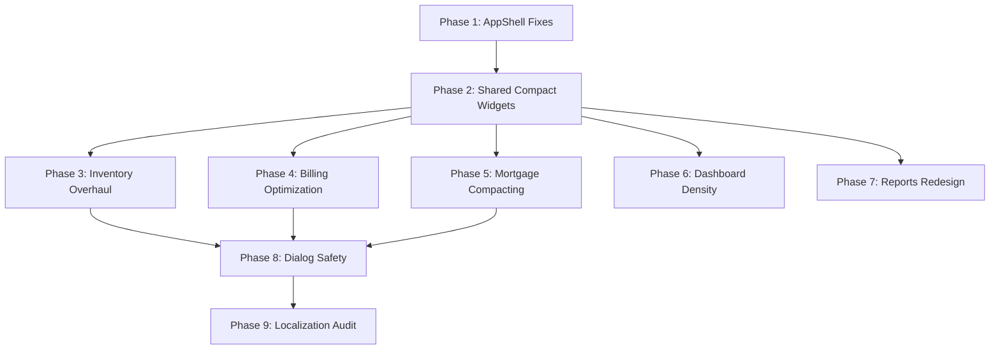

# SwarnaLekh UI/UX Revamp & Bug-Fix Plan

Complete mobile-first redesign to make the Jewellery ERP **efficient, compact, and super-easy to use on phones**. Eliminates excessive scrolling, replaces bloated DataTables with compact list items, fixes navigation bugs, and localizes remaining hard-coded strings.

---

## User Review Required

> [!IMPORTANT]
> This plan touches **every major screen** in the app. It should be executed in the order listed below since later phases depend on shared widgets created in earlier phases.

> [!WARNING]
> Several screens contain **hard-coded English strings** that violate the project's localization rules. Phase 9 addresses all of them. Every new or changed UI string must go through the `.arb` localization files.

---

## Open Questions

> [!IMPORTANT]
> **Hamburger menu on mobile**: The top bar on mobile shows a hamburger icon (`Icons.menu_rounded`) at line 304 of [app_shell.dart](file:///Users/satyamjaiswal/Desktop/Workspaces/swarnabook/apps/mobile/lib/shared/layouts/app_shell.dart#L302-L307) with an empty `onPressed: () {}`. Should this open a drawer with admin links (Shop Profile, Security, User Management), or should those stay behind the profile avatar popup only?

> [!IMPORTANT]
> **Inventory view mode preference**: Currently inventory shows a `DataTable`. The plan replaces it with a `ListView.builder` of compact card tiles on mobile (<768px) and keeps a simplified table on desktop. Should there be a toggle button to switch between card/table views, or should it be purely responsive?

---

## Proposed Changes

### Phase 1 — AppShell & Navigation Fixes

> Fixes broken mobile nav, dead hamburger button, and cramped top bar on small screens.

---

#### [MODIFY] [app_shell.dart](file:///Users/satyamjaiswal/Desktop/Workspaces/swarnabook/apps/mobile/lib/shared/layouts/app_shell.dart)

**Bug 1 — Dead hamburger menu button (line 304-307)**

```dart
// CURRENT (does nothing):
IconButton(
  visualDensity: VisualDensity.compact,
  icon: const Icon(Icons.menu_rounded),
  onPressed: () {},
),
```

**Fix**: Either remove the hamburger icon entirely (bottom nav already handles navigation), OR wire it to open a `Drawer` with admin links. Recommended: **remove the icon** — it confuses users.

**Bug 2 — Top bar too cramped on mobile (line 289-468)**

- On phones (<768px), the top bar has `height: 56` and packs: hamburger + title + theme toggle + language button + profile avatar. The title gets `Expanded` but often truncates.
- **Fix**: On mobile, hide the language button and move it into the profile popup menu. Reduce icon sizes. Show only: title (truncated), theme toggle, profile avatar.

**Bug 3 — Bottom nav index out of bounds**

- `_visibleNavItems` returns 4 items for staff (no Reports) but `widget.currentIndex` can be 4 when navigating to `/reports` via URL.
- Line 486: `widget.currentIndex.clamp(0, navItems.length - 1)` handles this, but there's no redirect. A staff user on `/reports` sees a blank page with wrong nav selected.
- **Fix**: Add a redirect guard in the router for staff users trying to access `/reports`.

**Changes Summary**:

1. Remove dead hamburger icon on mobile top bar.
2. Move language selector into profile popup on mobile.
3. Add SafeArea bottom padding consideration for the content area.

---

### Phase 2 — Shared Compact Widgets

> Create reusable compact widgets that all screens will use instead of duplicating card/metric patterns.

---

#### [NEW] [compact_data_row.dart](file:///Users/satyamjaiswal/Desktop/Workspaces/swarnabook/apps/mobile/lib/shared/widgets/compact_data_row.dart)

A reusable **compact list-item card** for displaying data rows (replaces `DataTable` rows on mobile):

```dart
class CompactDataRow extends StatelessWidget {
  final Widget? leading;          // icon or image (40x40)
  final String title;             // primary text
  final String? subtitle;         // secondary line
  final List<(String, String)> metrics; // key-value pairs shown inline
  final Widget? trailing;         // status badge or action button
  final VoidCallback? onTap;
  // ... compact layout with Row/Column, no GlassCard wrapping
}
```

**Design rationale**: Every screen (inventory, billing, mortgage, reports) shows tabular data that's unreadable on mobile. This single widget replaces `DataTable` with a touch-friendly, compact layout that shows the **most important 3-4 fields** inline and hides the rest behind a tap-to-expand or detail dialog.

#### [NEW] [compact_stat_strip.dart](file:///Users/satyamjaiswal/Desktop/Workspaces/swarnabook/apps/mobile/lib/shared/widgets/compact_stat_strip.dart)

A horizontal **stat strip** for mobile — replaces the 4-card `StatCard` grid with a single scrollable row of mini stat badges:

```dart
class CompactStatStrip extends StatelessWidget {
  final List<({IconData icon, String label, String value, Color color})> stats;
  // Renders as a horizontal ScrollView of compact chips/badges
}
```

**Why**: On mobile, 4 full `StatCard` widgets eat 400+ px of vertical space before any data is visible. This strip takes ~60px.

---

### Phase 3 — Inventory Screen Overhaul (Highest Priority)

> The **worst mobile experience** — a `DataTable` inside `SingleChildScrollView` × 2 (horizontal + vertical). Users must scroll in two dimensions. 11 columns, most irrelevant at a glance.

---

#### [MODIFY] [inventory_list_screen.dart](file:///Users/satyamjaiswal/Desktop/Workspaces/swarnabook/apps/mobile/lib/features/inventory/presentation/screens/inventory_list_screen.dart)

**Problem 1 — DataTable unusable on mobile (lines 824-937)**

```dart
// CURRENT: Double-nested ScrollView + DataTable with 11 columns
return GlassCard(
  padding: EdgeInsets.zero,
  child: SingleChildScrollView(
    scrollDirection: Axis.horizontal,
    child: SingleChildScrollView(
      child: DataTable(
        columns: [Image, Item, Category, Design Number, Purity, Gross Weight, Net Weight, Selling Price, Status, Branch, Actions],
        // 11 columns!
      ),
    ),
  ),
);
```

**Fix — Replace with responsive layout**:

- **Mobile (<768px)**: Use `ListView.builder` with `CompactDataRow`. Each row shows:
  - Leading: product image (40×40)
  - Title: item name
  - Subtitle: `category • purity • tag#`
  - Metrics: `Net: Xg | ₹Price`
  - Trailing: StatusBadge + overflow menu (view/edit/delete)
  - OnTap: opens the existing product detail dialog
- **Desktop (≥768px)**: Keep a simplified `DataTable` with 6-7 columns max (drop Image, Branch, Actions into row expansion).

**Problem 2 — Stats grid too tall on mobile (lines 516-571)**

- 4 `StatCard` widgets in a 2-column `Wrap` = ~280px before filters.
- **Fix**: Replace with `CompactStatStrip` on mobile. Keep `StatCard` grid on desktop.

**Problem 3 — Filter section is verbose (lines 617-760)**

- Search bar + metal chips + category field + branch field + status dropdown + rate date + item count = 5 separate rows on mobile.
- **Fix**: Collapse into a single search bar with an expandable filter drawer (an `ExpansionTile` or a bottom sheet triggered by a filter icon). Show only the search bar and item count by default.

**Problem 4 — Sold products also uses DataTable (lines 940-983)**

- Same double-scroll DataTable problem.
- **Fix**: Replace with `ListView.builder` + `CompactDataRow` using the same pattern as the main inventory list.

**Problem 5 — Inventory alerts take too much space (lines 573-614)**

- 4 `Chip` widgets in a `Wrap` — fine on desktop, but pushes content down on mobile.
- **Fix**: Only show alerts with non-zero values. On mobile, render as a single row of compact badges.

**File decomposition suggestion**: This file is **2,397 lines**. Extract:

- `_buildListView` + `CompactDataRow` usage → `inventory_list_view.dart`
- `_InventoryFormDialog` → `inventory_form_dialog.dart`
- `_OcrReviewDialog` → `ocr_review_dialog.dart`
- Product detail dialog → `product_detail_dialog.dart`

---

### Phase 4 — Billing Screen Mobile Optimization

> The billing screen is better structured than inventory but still has density issues and a problematic `DataTable` in the invoice creation dialog.

---

#### [MODIFY] [billing_screen.dart](file:///Users/satyamjaiswal/Desktop/Workspaces/swarnabook/apps/mobile/lib/features/billing/presentation/screens/billing_screen.dart)

**Problem 1 — Invoice cards too tall (lines 636-741, `_InvoiceCard`)**

- Each invoice card shows: title + customer + 4 metric boxes (140px wide each in a `Wrap`) + 4 action buttons = ~200px per card.
- **Fix**: Make the card more compact:
  - Inline the key metrics (Total, Paid, Balance, Items) as a single text row: `₹25,000 | Paid: ₹20,000 | Bal: ₹5,000 | 3 items`
  - Keep the action buttons but make them smaller `IconButton` without `filledTonal` styling.
  - Target: each card should be ~100-120px on mobile.

**Problem 2 — Dashboard stat cards on mobile (lines 247-336)**

- Same 4 `StatCard` in 2-column grid issue as inventory.
- **Fix**: Use `CompactStatStrip` on mobile.

**Problem 3 — Create Invoice dialog DataTable (lines 1480-1526, `_buildBillTable`)**

- The bill preview table inside the create invoice dialog uses `DataTable` with horizontal scroll.
- **Fix**: Replace with a simple `Column` of `ListTile`-style rows showing: product name, weight, qty, price. No table headers needed for 1-5 items.

**Problem 4 — Invoice detail dialog hardcoded widths (line 839)**

- `SizedBox(width: 860)` — clips on phones.
- **Fix**: Use `MediaQuery.of(context).size.width * 0.9` with a max width of 860.

**Problem 5 — Summary panels hardcoded widths (lines 1146-1193)**

- `_infoPanel` uses `SizedBox(width: 300)`, `_summaryPanel` uses `Container(width: 380)`.
- **Fix**: Remove fixed widths. Use `LayoutBuilder` or `Flexible`/`Expanded` inside the `Wrap`.

---

### Phase 5 — Mortgage Screen Compacting

> Mortgage cards are extremely tall with metrics wrapped in 150px-wide boxes.

---

#### [MODIFY] [mortgage_screen.dart](file:///Users/satyamjaiswal/Desktop/Workspaces/swarnabook/apps/mobile/lib/features/mortgage/presentation/screens/mortgage_screen.dart)

**Problem 1 — Loan card metrics (lines 482-519)**

- 7-8 metrics each in a `Container(width: 150)` box with padding. A single card can be 500+ px tall on mobile.
- **Fix**: Replace the wrapped metric boxes with a compact 2-column grid or inline text:
  ```
  Loan: ₹50,000 | Outstanding: ₹30,000
  Interest: ₹2,000 | Due: 15 Jul 2026
  ```
  Use `Table` with 2 columns or a simple `Wrap` of `Text` widgets with minimal padding.

**Problem 2 — Dashboard cards same issue (lines 225-281)**

- 6 `StatCard` widgets in a responsive `Wrap`.
- **Fix**: Use `CompactStatStrip` on mobile, keep cards on desktop.

**Problem 3 — Header too verbose (lines 196-223)**

- Title + subtitle text + "Add Mortgage" button in a `Row`.
- On mobile the title wraps and the button gets crushed.
- **Fix**: On mobile, move the "Add Mortgage" button to a `FloatingActionButton` or into the section switch row.

**Problem 4 — Hard-coded English strings (throughout)**

- Lines 93, 104, 116, 129, 143, 207-210, 217, 229, 240, 252, 259, 297, 314, 347-349, 424, 436, 448, 457, 530, 684, 721, 774, etc.
- All need to be extracted to `.arb` files.

---

### Phase 6 — Dashboard Density Improvement

> Dashboard is the best-structured screen but still wastes space on mobile.

---

#### [MODIFY] [dashboard_screen.dart](file:///Users/satyamjaiswal/Desktop/Workspaces/swarnabook/apps/mobile/lib/features/dashboard/presentation/screens/dashboard_screen.dart)

**Problem 1 — Welcome banner too tall on mobile (lines 191-270)**

- 80×80 diamond icon on the right, large display text. Takes ~180px.
- **Fix**: On mobile, reduce the diamond icon to 48×48, use `titleLarge` instead of `displaySmall` for the greeting, and hide the shop name line if it duplicates the page title.

**Problem 2 — 9 stat cards in 2-column grid (lines 518-605)**

- That's 5 rows of stat cards before any chart. ~700px of stats.
- **Fix**: Show top 4 stats in `CompactStatStrip`, then a "View all stats" expandable section. Or use a 3-column grid even on wider phones.

**Problem 3 — Quick actions sizing on mobile (lines 300-396)**

- 5 `QuickActionCard` in a `Wrap`. At 2 columns on mobile = 3 rows of cards.
- **Fix**: Make quick actions a horizontal `ScrollView` of smaller action chips (icon + label only, no subtitle).

**Problem 4 — Revenue chart label 'Revenue Trend (Mock)' exposed to users (line 415)**

- Remove "(Mock)" from the label. Users shouldn't see debug labels.

---

### Phase 7 — Reports Screen Mobile-First Redesign

> Reports is admin-only but still suffers from wide filter bars and verbose layouts.

---

#### [MODIFY] [reports_screen.dart](file:///Users/satyamjaiswal/Desktop/Workspaces/swarnabook/apps/mobile/lib/features/reports/presentation/screens/reports_screen.dart)

**Problem 1 — Filter bar has 6 input fields in a row (lines 253-353)**

- Search (320px) + From date (170px) + To date (170px) + Category (190px) + Branch (190px) + Status dropdown (180px) + Refresh button.
- On mobile these wrap into 6+ rows of full-width fields, pushing actual report content far below.
- **Fix**: Show only a search bar by default. Add a "Filters" button that opens a bottom sheet with the date, category, branch, and status filters.

**Problem 2 — Hard-coded English strings throughout**

- Same as mortgage — all labels, titles, subtitles need localization.

**Problem 3 — Report rows take too much space**

- `_ReportSection` uses `_ReportRow` which has a leading icon, title, subtitle, status badge, and 3-5 metric cells. Each row is ~100px.
- **Fix**: Make report rows more compact — reduce padding, use smaller font, show max 3 metrics inline with the rest behind a tap.

---

### Phase 8 — Dialog & Form Keyboard/Scroll Safety

> Several dialogs have usability bugs on mobile keyboards.

---

#### [MODIFY] Multiple dialog widgets across screens

**Bug 1 — Create Invoice dialog is unusable on phones**

- [billing_screen.dart lines 1528-1921](file:///Users/satyamjaiswal/Desktop/Workspaces/swarnabook/apps/mobile/lib/features/billing/presentation/screens/billing_screen.dart#L1528-L1921): Uses `AlertDialog` with `SizedBox(width: 720)`. On a 375px phone this clips.
- **Fix**: On mobile, replace `AlertDialog` with a **full-screen dialog** (`showGeneralDialog` or `Navigator.push` with `MaterialPageRoute(fullscreenDialog: true)`). Keep AlertDialog on desktop.

**Bug 2 — Mortgage create dialog (mortgage_screen.dart)**

- Same pattern — `AlertDialog` with long form content that doesn't fit on phone screens.
- **Fix**: Same approach — full-screen dialog on mobile.

**Bug 3 — Inventory form dialog**

- Same issue. The form has 15+ fields that require extensive scrolling inside a dialog.
- **Fix**: Full-screen dialog on mobile.

**General rule**: Any dialog with more than 4-5 form fields should use a full-screen dialog on mobile (width < 768px).

---

### Phase 9 — Hard-Coded String Localization Audit

> The project has **localization rules** requiring all user-facing strings to go through `.arb` files. Multiple screens violate this.

---

#### [MODIFY] [app_en.arb](file:///Users/satyamjaiswal/Desktop/Workspaces/swarnabook/apps/mobile/lib/l10n/app_en.arb), [app_hi.arb](file:///Users/satyamjaiswal/Desktop/Workspaces/swarnabook/apps/mobile/lib/l10n/app_hi.arb), [app_gu.arb](file:///Users/satyamjaiswal/Desktop/Workspaces/swarnabook/apps/mobile/lib/l10n/app_gu.arb)

**Screens with hard-coded English strings** (needs l10n extraction):

| Screen          | File                          | Example strings                                                                                                  |
| --------------- | ----------------------------- | ---------------------------------------------------------------------------------------------------------------- |
| Mortgage        | `mortgage_screen.dart`        | 'Mortgage / Gold Loan', 'Add Mortgage', 'Active Loans', 'Closed Loans', 'Pending Interest', etc. (~40+ strings)  |
| Reports         | `reports_screen.dart`         | 'Reports', 'Inventory Reports', 'Billing Reports', 'Current Stock Report', 'GST Report', etc. (~50+ strings)     |
| Security        | `security_screen.dart`        | 'Security' (in router and popup menu)                                                                            |
| User Management | `user_management_screen.dart` | 'User Management' (in router and popup menu)                                                                     |
| App Shell       | `app_shell.dart`              | 'Security', 'User Management', 'Toggle theme' (popup menu items)                                                 |
| Inventory       | `inventory_list_screen.dart`  | 'Inventory Management', 'View Inventory', 'Add Stock', 'Sold Products', 'Total Gold Weight', etc. (~30+ strings) |
| Dashboard       | `dashboard_screen.dart`       | 'Total Gold Stock', 'Total Silver Stock', 'Revenue Trend (Mock)', etc. (~15+ strings)                            |

**Process for each string**:

1. Add key+value to `app_en.arb`
2. Add Hindi translation to `app_hi.arb`
3. Add Gujarati translation to `app_gu.arb`
4. Replace hard-coded string with `l10n.newKey` in the widget
5. Run `flutter gen-l10n`

---

## Verification Plan

### Automated Tests

```bash
cd apps/mobile && flutter gen-l10n
cd apps/mobile && flutter analyze
cd apps/mobile && flutter test
```

### Manual Verification

**For each phase, verify on these screen sizes:**

| Device    | Width  | What to check                                     |
| --------- | ------ | ------------------------------------------------- |
| iPhone SE | 375px  | Cards fit, no horizontal overflow, dialogs usable |
| iPhone 15 | 393px  | Same + bottom nav doesn't clip                    |
| iPad Mini | 768px  | Sidebar appears, tables visible                   |
| Desktop   | 1280px | Full layout, all columns visible                  |

**Phase-specific checks:**

1. **Phase 1**: Bottom nav works on all tabs, no dead hamburger icon, profile menu includes language on mobile
2. **Phase 2**: Shared widgets render correctly in isolation
3. **Phase 3**: Inventory list scrolls smoothly, product images visible, edit/delete actions accessible, search works
4. **Phase 4**: Invoice creation flow works end-to-end on phone, bill preview readable
5. **Phase 5**: Mortgage cards readable in 1 screen, payment collection works
6. **Phase 6**: Dashboard loads all stats, no "(Mock)" label, quick actions navigable
7. **Phase 7**: Reports filters don't push content off-screen
8. **Phase 8**: All forms submittable with keyboard open, no clip/overflow
9. **Phase 9**: `flutter analyze` passes with no unused import or missing l10n warnings

---

## Execution Order & Dependencies



**Phases 3-7 can run in parallel** after Phase 2 is complete. Phase 8 depends on screens being refactored. Phase 9 is a final sweep.

**Estimated effort**: ~8-12 hours of focused coding across all 9 phases.
